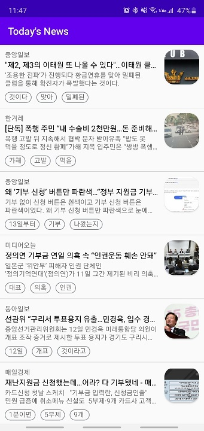

# RSS 최신 뉴스 앱

구글의 RSS피드를 파싱해 실시간 최신 뉴스를 받아오는 앱입니다.
- RSS 소스 링크: https://news.google.com/rss?hl=ko&gl=KR&ceid=KR:ko

### 리스트에서 보여주는 데이터
- 뉴스 출처
- 뉴스 제목
- 뉴스 요약
- 출현 빈도가 높은 세 개의 키워드
- 썸네일 (우측)

** 리스트 데이터 파싱방식 수정중...

#### XML 샘플
```xml
<item>
<title>국가대표 선수 '음주운전' 처벌 강화된다 - 한겨레</title>
<link>
https://news.google.com/__i/rss/rd/articles/CBMiPGh0dHA6Ly93d3cuaGFuaS5jby5rci9hcnRpL3Nwb3J0cy9zcG9ydHNfZ2VuZXJhbC85NDcwNjguaHRtbNIBAA?oc=5
</link>
<guid isPermaLink="false">
CBMiPGh0dHA6Ly93d3cuaGFuaS5jby5rci9hcnRpL3Nwb3J0cy9zcG9ydHNfZ2VuZXJhbC85NDcwNjguaHRtbNIBAA
</guid>
<pubDate>Fri, 29 May 2020 02:18:40 GMT</pubDate>
<description>
<a href="https://news.google.com/__i/rss/rd/articles/CBMiPGh0dHA6Ly93d3cuaGFuaS5jby5rci9hcnRpL3Nwb3J0cy9zcG9ydHNfZ2VuZXJhbC85NDcwNjguaHRtbNIBAA?oc=5" target="_blank">국가대표 선수 '음주운전' 처벌 강화된다</a>&nbsp;&nbsp;<font color="#6f6f6f">한겨레</font>
</description>
<source url="http://www.hani.co.kr">한겨레</source>
</item>
```


